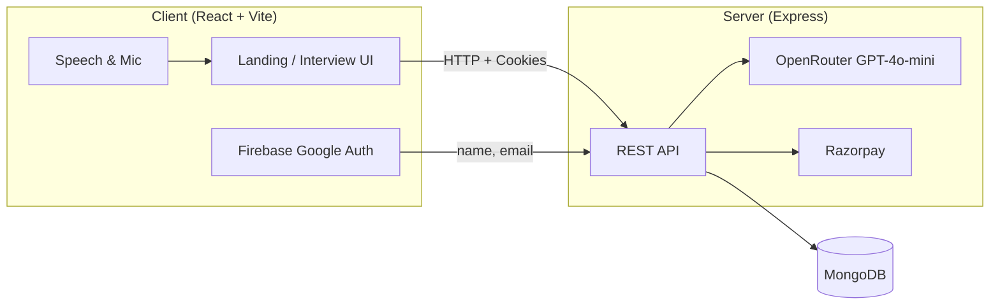

# AI Interview Agent

> An AI-powered mock interview platform that helps candidates practice real interview scenarios, get instant feedback, and track performance over time.

**Author:** [Ritam Majumdar](https://github.com/ritammajumdar)

---

## About

**AI Interview Agent** is a full-stack web application that simulates professional job interviews using AI. Users can upload a resume, choose a role and interview mode, answer questions via voice or text, and receive detailed performance analytics — including confidence, communication, and correctness scores.

The project is split into two apps:

| Directory | Description |
|-----------|-------------|
| [`client/`](./client) | React frontend — interview UI, voice interaction, reports, payments |
| [`server/`](./server) | Express API — auth, AI logic, MongoDB, Razorpay |

For deeper documentation, see:
- [Client README](./client/README.md)
- [Server README](./server/README.md)

---

## Features

- **Google Authentication** — Sign in with Firebase Google OAuth
- **Resume-Based Interviews** — Upload a PDF resume; AI extracts role, skills, and projects
- **Smart Question Generation** — 5 tailored questions with adaptive difficulty (Easy → Hard)
- **Voice Interview Mode** — AI speaks questions; candidates answer via microphone or text
- **Live Timer Simulation** — Per-question countdown with auto-submit on timeout
- **AI Answer Evaluation** — Scores confidence, communication, and correctness with feedback
- **Performance Dashboard** — Charts, skill breakdown, and question-wise analysis
- **PDF Report Export** — Download a full interview report as PDF
- **Interview History** — View and revisit past interview sessions
- **Credit System** — Pay-per-interview model with Razorpay top-ups

---

## Tech Stack

### Frontend (`client`)


React 19 · Vite 8 · Tailwind CSS 4 · Redux Toolkit · React Router · Firebase Auth · Razorpay · Recharts · jsPDF · Motion

### Backend (`server`)


Express 5 · MongoDB · Mongoose · JWT · OpenRouter AI · Razorpay · Multer · pdfjs-dist

---

## Architecture



---

## Project Structure

```text
ai-interview-agent/
├── client/                  # React frontend
│   ├── src/
│   │   ├── pages/           # Home, Auth, Interview, History, Pricing, Report
│   │   ├── components/      # Navbar, interview steps, timer, modals
│   │   ├── redux/           # User state management
│   │   └── utils/           # Firebase config
│   └── README.md
├── server/                  # Express backend
│   ├── controller/          # Route handlers
│   ├── models/              # MongoDB schemas
│   ├── routes/              # API routes
│   ├── services/            # OpenRouter & Razorpay
│   ├── middleware/          # Auth & file upload
│   └── README.md
└── README.md
```

---

## Prerequisites

Before you begin, make sure you have:

- [Node.js](https://nodejs.org/) (v18+ recommended)
- [MongoDB](https://www.mongodb.com/) (local or Atlas)
- [Firebase](https://firebase.google.com/) project with Google Sign-In enabled
- [OpenRouter](https://openrouter.ai/) API key
- [Razorpay](https://razorpay.com/) account (test keys work for development)

---

## Getting Started

### 1. Clone the repository

```bash
git clone https://github.com/your-username/ai-interview-agent.git
cd ai-interview-agent
```

### 2. Install dependencies

```bash
# Install server dependencies
cd server
npm install

# Install client dependencies
cd ../client
npm install
```

### 3. Configure environment variables

**Server** — create `server/.env`:

```env
PORT=5000
MONGODB_URL=mongodb://localhost:27017/ai-interview-agent
JWT_SECRET=your_jwt_secret_here

OPENROUTER_API_KEY=your_openrouter_api_key

RAZORPAY_KEY_ID=your_razorpay_key_id
RAZORPAY_KEY_SECRET=your_razorpay_key_secret
```

**Client** — create `client/.env`:

```env
VITE_FIREBASE_APIKEY=your_firebase_api_key
VITE_RAZORPAY_KEY_ID=your_razorpay_key_id
```

### 4. Update backend URL in client

In `client/src/App.jsx`, set `ServerUrl` to match your running backend:

```js
export const ServerUrl = "http://localhost:5000"
```

> The server runs on port `5000` by default. Make sure this matches your `PORT` in `server/.env`.

---

## Running Locally

Open two terminals:

**Terminal 1 — Server**

```bash
cd server
npm run dev
```

Server starts at `http://localhost:5000`

**Terminal 2 — Client**

```bash
cd client
npm run dev
```

Client starts at `http://localhost:5173`

---

## How It Works

### Interview Flow

1. **Sign in** with Google (Firebase → backend JWT cookie)
2. **Set up** role, experience, and interview mode (Technical / HR)
3. **Upload resume** (optional) — AI parses skills and projects
4. **Start interview** — 50 credits deducted; 5 AI questions generated
5. **Answer questions** — voice or text, with live timer per question
6. **Get feedback** — AI evaluates each answer in real time
7. **View report** — scores, charts, feedback, and PDF download

### Credit System

| Action | Credits |
|--------|---------|
| New user | 100 (free) |
| Start interview | −50 |
| Starter Pack (₹100) | +150 |
| Pro Pack (₹500) | +650 |

---

## API Overview

| Group | Base Path | Description |
|-------|-----------|-------------|
| Auth | `/api/auth` | Google login, logout |
| User | `/api/user` | Current user profile |
| Interview | `/api/interview` | Resume, questions, answers, reports |
| Payment | `/api/payment` | Razorpay order & verification |

Full endpoint documentation: [server/README.md](./server/README.md)

---

## Scripts

### Client

| Command | Description |
|---------|-------------|
| `npm run dev` | Start Vite dev server |
| `npm run build` | Production build |
| `npm run preview` | Preview production build |
| `npm run lint` | Run ESLint |

### Server

| Command | Description |
|---------|-------------|
| `npm run dev` | Start server with nodemon |
| `node index.js` | Start server (production) |

---

## Deployment

| Component | Suggested Hosting |
|-----------|-------------------|
| Client | Vercel, Netlify, or any static host |
| Server | Render, Railway, AWS, or any Node.js host |
| Database | MongoDB Atlas |

**Production checklist:**

- Set all environment variables on both client and server
- Update `ServerUrl` in `client/src/App.jsx` to your deployed API URL
- Update CORS `origin` in `server/index.js` to your frontend domain
- Use HTTPS so secure cookies work correctly
- Use Razorpay live keys for real payments

---

## Contributing

Contributions are welcome.

1. Fork the repository
2. Create a feature branch (`git checkout -b feature/your-feature`)
3. Commit your changes (`git commit -m "Add your feature"`)
4. Push to the branch (`git push origin feature/your-feature`)
5. Open a Pull Request

---

## License

This project is licensed under the **MIT License**.

---

## Author

**Ritam Majumdar**

Built with React, Express, MongoDB, and OpenRouter AI.

---

<p align="center">
  If this project helped you, consider giving it a ⭐ on GitHub!
</p>
